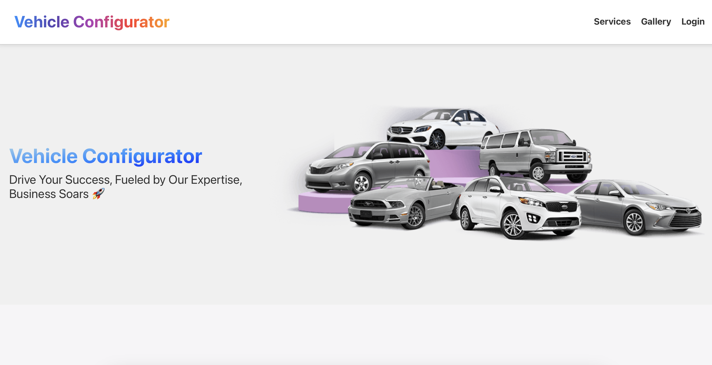

# Vehicle Configurator

## Overview

Vehicle Configurator is a B2B portal using Spring 6, Maven 3, Spring boot 3, REST API, MySQL8, JPA, Docker, JWT, MicroService, DotNet core, Web API Core 7.0, SQL Server, Entity Core 7.0 , React Js 18. The leasing company is the sponsor of the project, however, the users will be the rental car company that are the customers of the sponsor who need a fleet of cars on lease. The system allows users to select the car and configure it as per defined conditions for each model. The cost of the vehicle keeps on changing accordingly. The database driven system is easy to maintain. At the end of successful transaction invoice with all vehicle details is mailed in PDF format.

## Features

- **User Authentication**: Utilizes JWT for secure user authentication and authorization.
- **Car Selection and Configuration**: Allows users to select from a variety of car models and configure them according to predefined conditions.
- **Dynamic Pricing**: The cost of the vehicle adjusts dynamically based on the selected configuration.
- **Database-Driven System**: Utilizes MySQL 8 and SQL Server for storing and managing data, ensuring easy maintenance and scalability.
- **Invoice Generation**: Generates detailed invoices in PDF format at the end of a successful transaction.

## Usage

1. **User Registration/Login**: Users can register and log in using their credentials to access the portal.
2. **Car Selection**: Browse through available car models and select the desired ones.
3. **Configuration**: Customize each selected car based on specified conditions, such as color, features, etc.
4. **Pricing**: View dynamic pricing adjustments as per the selected configurations.
5. **Transaction**: Complete the leasing transaction, and upon success, receive an invoice in PDF format.

## Screenshots




## Installation

### Clone the Repository
git clone https://github.com/Worldwiin/Vehicle_configurator.git

```bash
cd Vehicle_configurator

# Set up the backend:
# Navigate to the backend directory:
cd backend

# Install dependencies:
mvn clean install

# Run the Spring Boot application:
mvn spring-boot:run

# Set up the frontend:
# Navigate to the frontend directory:
cd frontend

# Install dependencies:
npm install

# Start the React application:
npm start

